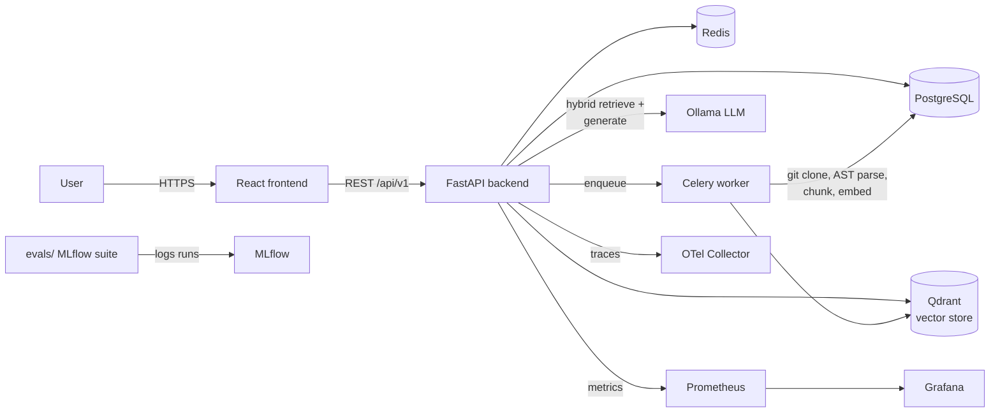
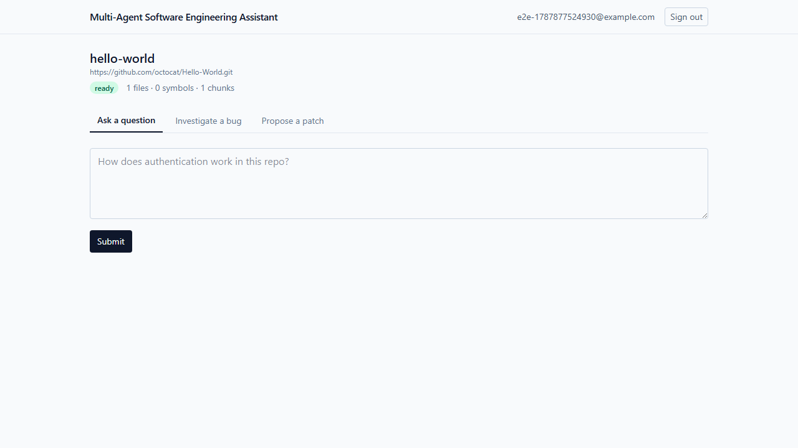
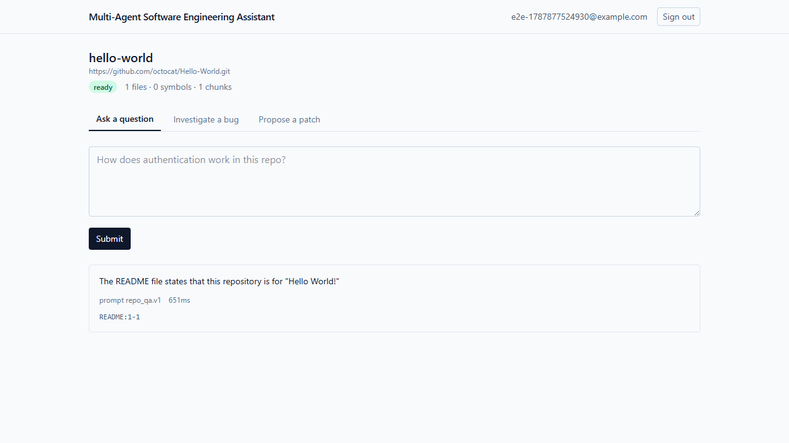
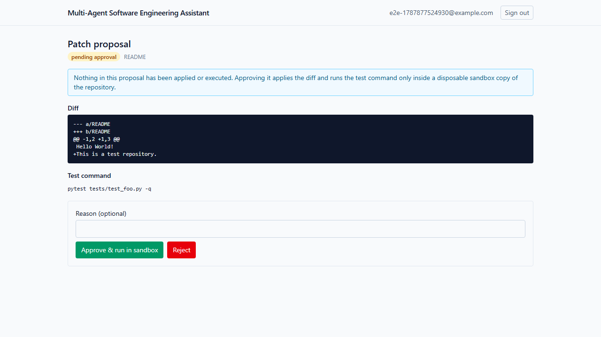
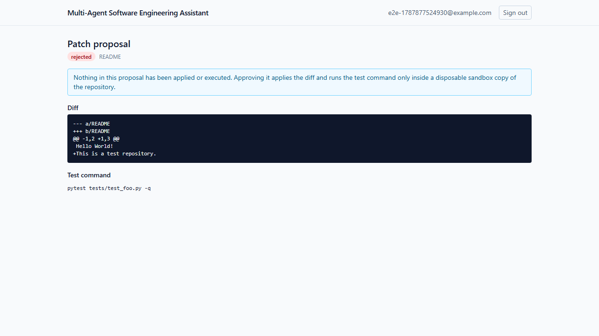

# Multi-Agent Software Engineering Assistant

A self-hosted engineering assistant that ingests a Git repository, builds a
hybrid lexical/dense retrieval index over it, and answers questions, helps
investigate bugs, and proposes patches — every answer grounded in citations
that resolve to real files and line numbers, and every patch gated behind
explicit human approval before it's ever applied or executed.

Built by **Shriya Patel** ([portfolio](https://shriya-patel-software-portfolio.vercel.app/)) as a demonstration of backend systems, retrieval-augmented
generation, and agentic workflow design running entirely on free, local,
self-hosted infrastructure — no paid API keys required.

## Status

Working end-to-end, verified against a real local [Ollama](https://ollama.com)
model and a real cloned GitHub repository (see [Evidence](#evidence) below):

- ✅ Secure repository ingestion (SSRF-guarded clone, Python AST symbol
  extraction, LangChain-based chunking)
- ✅ Hybrid lexical + dense retrieval (Postgres full-text + Qdrant, fused
  with Reciprocal Rank Fusion)
- ✅ Three agent workflows: repository Q&A, bug investigation, patch
  proposal — each backed by a deterministic graph-style orchestrator
- ✅ Human-gated patch approval: nothing is applied or executed until a
  person explicitly approves it, and even then only inside a disposable
  sandbox copy of the repository
- ✅ Argon2id password hashing, JWT access/refresh rotation with reuse
  detection
- ✅ Async Celery ingestion worker, Prometheus metrics, OpenTelemetry
  tracing, structured logging
- ✅ React/TypeScript frontend covering the full flow
- ✅ Reproducible MLflow evaluation suite (`evals/`)
- ✅ Docker Compose brings up the entire free local stack from a clean clone

Known, documented limitations (not hidden — see [Limitations](#limitations)):
small local chat models don't always produce perfectly-formatted diffs or
follow citation formatting instructions exactly, and the patch sandbox
doesn't pre-install arbitrary target-repository test dependencies.

## Architecture



See [docs/architecture.md](docs/architecture.md) for the full component and
deployment views, and [docs/adr/](docs/adr/) for the reasoning behind key
decisions (e.g. why the agent orchestration is a small hand-rolled graph
instead of LangGraph).

## Stack

Python 3.11 · FastAPI · async SQLAlchemy 2.0 · Alembic · PostgreSQL ·
Redis · Celery · Qdrant · Ollama · LangChain (chunking/LLM clients) ·
React 19 · TypeScript · Vite · Tailwind CSS · Docker Compose · Kubernetes ·
Terraform · GitHub Actions · Jenkins · MLflow · Prometheus · Grafana ·
OpenTelemetry

## Quickstart

Requires Docker and Docker Compose. Everything below runs with **no paid
account or API key**.

```bash
git clone https://github.com/spatel842002/Multi-agent-Software-Engineering-assistant.git
cd Multi-agent-Software-Engineering-assistant
cp .env.example .env   # only needed if a default port below is already taken on your machine
docker compose up -d --build
```

Wait for the backend to report healthy (`docker compose ps`), then pull the
two small local models the LLM/embedding workflows use:

```bash
docker compose exec ollama ollama pull qwen2.5-coder:1.5b
docker compose exec ollama ollama pull nomic-embed-text
```

Apply database migrations:

```bash
docker compose exec backend alembic upgrade head
```

Open the app:

- Frontend: http://localhost:5173
- Backend API docs (Swagger UI): http://localhost:8000/docs
- MLflow: http://localhost:5000
- Grafana: http://localhost:3001 (admin/admin)
- Prometheus: http://localhost:9090

Register an account in the UI, ingest a public `https://` Git repository,
and once its status is "ready", ask it a question. See
[docs/local-development.md](docs/local-development.md) for the full setup
(including running the backend/frontend outside Docker for active
development) and [docs/troubleshooting.md](docs/troubleshooting.md) if a
step above doesn't work as described.

## Demo accounts

There are no seeded demo accounts — registration is self-service and local
to your own Postgres instance. Register any email/password (12+ characters)
at `/register`.

## Evidence

Real, committed evidence from running the full stack end-to-end against real
cloned repositories and a real local `qwen2.5-coder:1.5b` model — not a mock,
not a fabricated transcript. Full set (including raw API JSON transcripts)
in [docs/assets/screenshots/](docs/assets/screenshots/); a few below:

| | |
|---|---|
|  |  |
| Repository ingested from a real clone of `octocat/Hello-World` | A real, cited answer from the repo-Q&A workflow |
|  |  |
| A real patch proposal, pending human approval | After rejection — nothing was ever applied or executed |

- [docs/benchmarks/eval_report_fake.json](docs/benchmarks/eval_report_fake.json) —
  reproducible eval run (deterministic fake provider, CI-safe)

Reproduce it yourself:

```bash
# Deterministic, offline, no Ollama required:
python evals/run_evals.py --provider fake

# Real answer/patch quality against your local Ollama:
python evals/run_evals.py --provider ollama
```

## Scripts

| Command | What it does |
|---|---|
| `docker compose up -d --build` | Start the full local stack |
| `docker compose exec backend alembic upgrade head` | Apply DB migrations |
| `python evals/run_evals.py --provider fake\|ollama` | Run the eval suite |
| `cd backend && pytest` | Backend test suite |
| `cd frontend && npm test` | Frontend unit/component tests |
| `cd frontend && npm run test:e2e` | Frontend e2e smoke test (needs the full stack running) |
| `python scripts/demo.py` | Scriptable end-to-end demo over HTTP (register → ingest → ask → propose a patch → reject) |
| `bash scripts/reset_db.sh` | Reset the database schema to a clean state (drops and reapplies every migration) |

## Tests

- Backend: 65 tests (unit, contract, integration) — see
  [docs/testing.md](docs/testing.md) for exact commands and current coverage
- Frontend: component/unit tests (Vitest + Testing Library) plus one
  Playwright end-to-end smoke test against the real stack
- `evals/`: a reproducible MLflow evaluation suite (retrieval quality,
  groundedness, citation accuracy, latency, task success)

## Limitations

Documented honestly, not hidden:

- Small local models (the free-tier default) sometimes wrap diffs in
  markdown fences, misformat a citation list, or omit a blank-line context
  marker in a hunk. The backend repairs the two common, well-understood
  mistakes; a genuinely malformed diff still correctly fails to apply in the
  sandbox rather than being silently accepted.
- The patch sandbox validates that a diff applies and (if the container has
  the tool) runs the proposed test command — it does not install a target
  repository's own dependencies, so `test_command` execution against an
  arbitrary repo commonly fails with "command not found" even when the
  diff itself applied cleanly. See
  [docs/architecture/retrieval-evaluation-methodology.md](docs/architecture/retrieval-evaluation-methodology.md).
- The sandbox is process-level isolation (a disposable directory copy plus a
  subprocess timeout), not a hermetic container/VM sandbox. See
  [docs/security.md](docs/security.md).
- Kubernetes manifests are YAML/schema-validated but not exercised against a
  live cluster in this environment; Terraform is `fmt`/`init`/`validate`d
  but never `apply`'d. See [docs/deployment.md](docs/deployment.md).

## Deployment

Local: `docker compose up`. Production reference: Kubernetes manifests under
[k8s/](k8s/) and a Terraform EKS reference module under
[terraform/eks/](terraform/eks/) (VPC, EKS, RDS Postgres, ElastiCache Redis,
S3 — see its [cost warning](terraform/eks/README.md#cost-warning) before
running `apply`). Full guide: [docs/deployment.md](docs/deployment.md).
The only work remaining before a real deployment is account/credential
provisioning — see
[docs/account-activation-checklist.md](docs/account-activation-checklist.md).

## Documentation

Architecture: [docs/architecture.md](docs/architecture.md) ·
Local dev: [docs/local-development.md](docs/local-development.md) ·
Testing: [docs/testing.md](docs/testing.md) ·
Deployment: [docs/deployment.md](docs/deployment.md) ·
Environment variables: [docs/environment-variables.md](docs/environment-variables.md) ·
Security/threat model: [docs/security.md](docs/security.md) ·
Observability: [docs/observability.md](docs/observability.md) ·
Runbook: [docs/runbook.md](docs/runbook.md) ·
Troubleshooting: [docs/troubleshooting.md](docs/troubleshooting.md) ·
API reference: [docs/api.md](docs/api.md) ·
Data model: [docs/data-model.md](docs/data-model.md) ·
Architecture decisions: [docs/adr/](docs/adr/)

## License

[MIT](LICENSE). Third-party dependencies and their licenses are catalogued
in [THIRD_PARTY_NOTICES.md](THIRD_PARTY_NOTICES.md).
