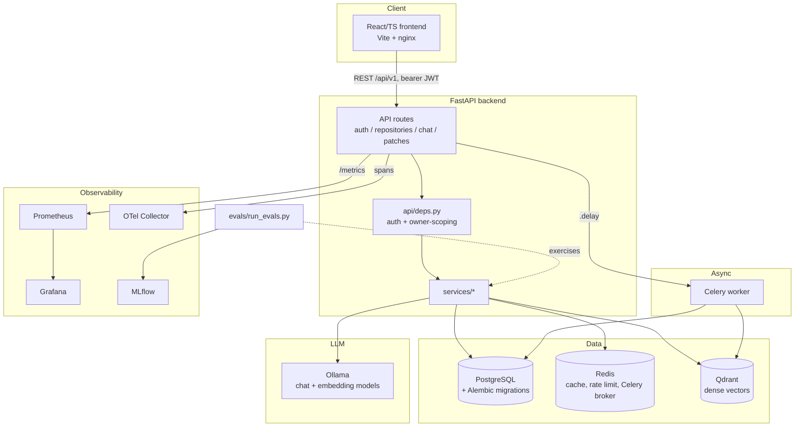
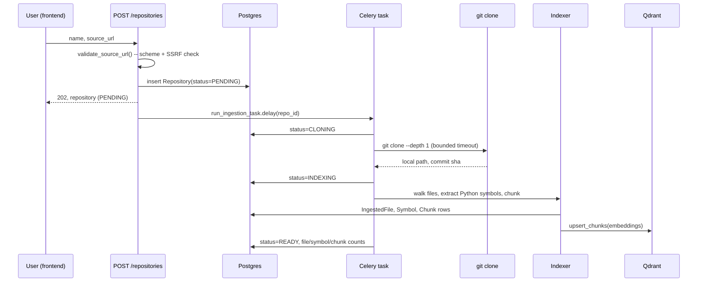
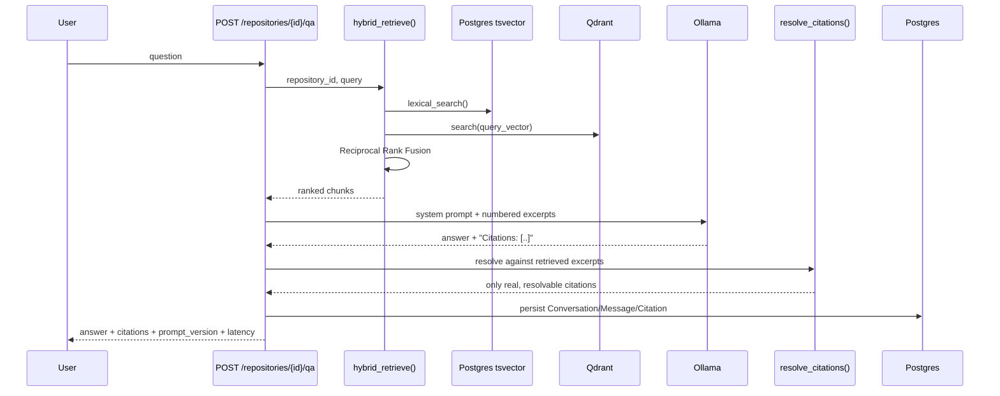
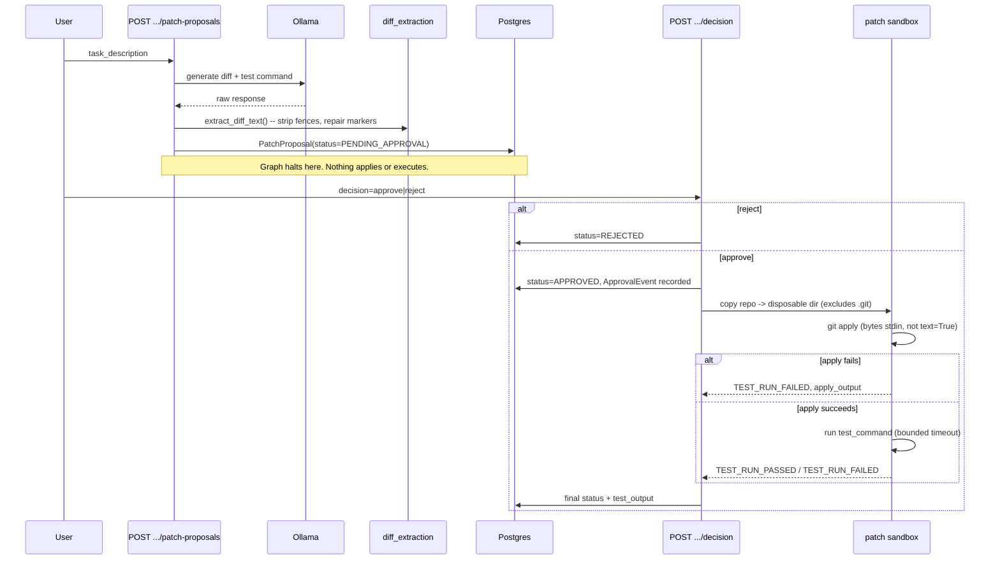

# Architecture

## System overview

## Request flow: repository ingestion

## Request flow: a retrieval-grounded workflow (Q&A / bug investigation)

## Request flow: patch proposal and human-gated approval

## Component map

| Layer | Path | Notes |
|---|---|---|
| API routes | `backend/app/api/routes/` | Thin: auth, request validation, calling services |
| Auth | `backend/app/core/security.py`, `services/auth.py` | Argon2id, JWT access + single-use refresh with reuse detection |
| Ingestion | `backend/app/services/ingestion/` | SSRF guard, clone, walk, Python AST symbols, LangChain chunking |
| Retrieval | `backend/app/services/retrieval/` | Lexical (Postgres tsvector), dense (Qdrant), RRF fusion |
| LLM | `backend/app/services/llm/` | `ChatProvider` port; Ollama and deterministic-fake implementations |
| Agent orchestration | `backend/app/services/agents/` | Graph executor, prompts, citation resolution, diff extraction, the 3 workflows |
| Patch approval | `backend/app/services/patch/` | The one path that can apply/execute a proposal; sandbox isolation |
| Async work | `backend/app/workers/` | Celery task wrapping ingestion with its own DB engine |
| Observability | `backend/app/core/telemetry.py` | Prometheus metrics, OTel tracing setup |
| Frontend | `frontend/src/` | React Router pages, a dependency-free typed `fetch` client, Tailwind |
| Evaluation | `evals/` | Reproducible MLflow eval suite, fake or real Ollama provider |
| Infra | `k8s/`, `terraform/eks/`, `infra/` | Kubernetes manifests, Terraform EKS reference, Prometheus/Grafana config |

## Why a hybrid retriever (not just embeddings)

Dense (embedding) search alone misses exact-identifier lookups common in
code search (a variable or function name is often a poor embedding-space
neighbor of its own usages). Lexical (full-text) search alone misses
semantic/paraphrased questions. Reciprocal Rank Fusion combines both
rankers' *positions* rather than trying to normalize incomparable score
scales (cosine similarity vs. `ts_rank`) — see
`backend/app/services/retrieval/hybrid.py`.

## Why the agent orchestration is a hand-rolled graph, not LangGraph

See [docs/adr/0004-hand-rolled-agent-graph.md](adr/0004-hand-rolled-agent-graph.md).

## Deployment view

Local: `docker compose up` brings up every service in this diagram on one
machine. Production reference: `k8s/` manifests (backend/worker/frontend
Deployments, a ConfigMap/Secret pair, an Ingress) targeting a cluster
provisioned by `terraform/eks/` (VPC, EKS, RDS Postgres, ElastiCache Redis,
S3) — see [docs/deployment.md](deployment.md).
