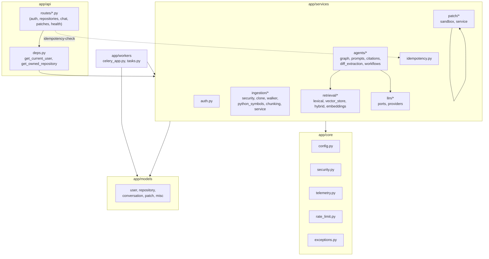

# Component view

## Dependency direction rules (enforced by convention, not tooling)

- `app/api/*` may import `app/services/*`, `app/models/*`, `app/schemas/*`,
  `app/core/*`. Never the reverse.
- `app/services/*` may import `app/models/*`, `app/core/*`, and other
  `app/services/*` submodules. Never `app/api/*`.
- `app/workers/*` imports `app/services/*` directly (it is itself a
  caller, like a route, not a service).
- Every "real vs. local/fake" provider pair (LLM chat, embeddings, vector
  store) is behind a `Protocol` in a `ports.py`, obtained only through a
  `get_*()` factory keyed off `settings.llm_provider` — see
  `services/retrieval/ports.py`, `services/llm/ports.py`.

## Where a new feature usually goes

| Kind of change | Where |
|---|---|
| New API endpoint | `app/api/routes/`, thin — calls into a service |
| New business rule / workflow step | `app/services/` |
| New DB table | `app/models/` + a new Alembic revision (`alembic revision --autogenerate`) |
| New background job | `app/workers/tasks.py`, following the `_run_coroutine_blocking` + own-DB-engine pattern (see its docstring) |
| New external integration (another LLM provider, another vector store) | A new implementation of the relevant `Protocol` in the matching `ports.py`, wired into its `get_*()` factory |
