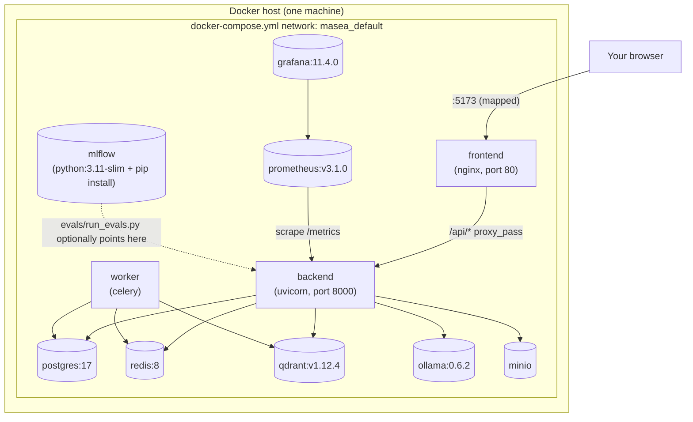
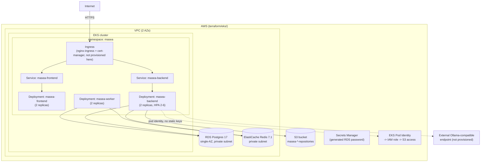

# Deployment view

## Local (Docker Compose) — verified, this is what was actually run

Every host port is overridable (`.env` at the repo root, see
`docs/environment-variables.md`) to avoid conflicts with anything else
running on the same machine — this mattered in practice during development
(the dev machine had another, unrelated project's Compose stack running
concurrently on several default ports).

## Production reference (Kubernetes on EKS) — infra-validated, not live-deployed

**What Terraform provisions**: VPC, EKS cluster + one managed node group,
RDS Postgres, ElastiCache Redis, an S3 bucket, and least-privilege IAM (Pod
Identity, no static AWS access keys). **What it does not provision**:
Qdrant, Ollama/an LLM endpoint, the nginx ingress controller, cert-manager,
or DNS — see `docs/account-activation-checklist.md` for exactly what's
left as an account/DNS/manual step, and `terraform/eks/README.md` for the
cost warning before running `apply`.

**Verification status**: `terraform fmt`/`init -backend=false`/`validate`
all pass against real Postgres-backed module resolution; `k8s/` manifests
are YAML-valid (`yaml.safe_load`) and, in CI, schema-validated with
`kubeconform`. Neither has been run against a live cluster or a real AWS
account in this environment — no cluster was created, matching the
program's local-first, no-paid-services-during-development constraint.
