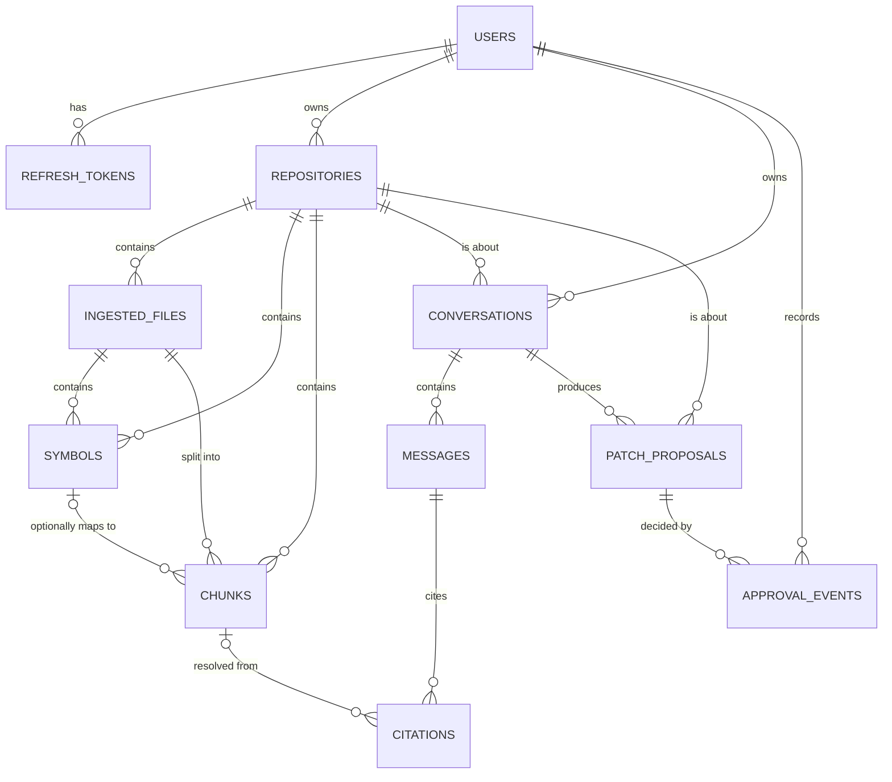

# Data model

PostgreSQL, managed via Alembic (`backend/alembic/versions/`). Source of
truth is the SQLAlchemy models in `backend/app/models/`; this doc is a
readable summary, not a replacement for reading the migrations.

## Tables

### `users`

`id` (UUID pk), `email` (unique, indexed), `hashed_password` (Argon2id),
`is_active`, `created_at`, `updated_at`.

### `refresh_tokens`

A rotation chain, not a flat session list. `token_hash` (SHA-256 of the
opaque token, unique, indexed — never store the raw token), `expires_at`,
`revoked_at` (nullable — set on rotation or on reuse-detection), and
`replaced_by_id` (self-referential FK) linking each token to the one that
replaced it. See [docs/security.md](security.md) for the reuse-detection
logic this enables.

### `repositories`

`owner_id` (FK → users), `name`, `source_url`, `default_branch`,
`local_path` (nullable until cloned), `status`
(`pending`/`cloning`/`indexing`/`ready`/`failed`), `status_detail`,
`commit_sha`, `file_count`/`symbol_count`/`chunk_count` (denormalized
summary counts, updated once ingestion completes).

### `ingested_files`

One row per file the ingestion walker kept (binary/oversized/ignored-dir
files are never persisted). `path` (relative to repo root), `language`
(detected from extension), `content_hash` (SHA-256), `size_bytes`.

### `symbols`

Python-only in this version (`kind` ∈ `module`/`class`/`function`/`method`).
`qualified_name` (e.g. `pkg.module.ClassName.method_name`), `start_line`/
`end_line`, `docstring`. Extracted via the standard library `ast` module —
see `services/ingestion/python_symbols.py`.

### `chunks`

The retrieval unit. `content`, `start_line`/`end_line` (real, verified line
spans — see `services/ingestion/chunking.py`), `content_hash`. A raw
Postgres-only generated column, **not modeled in the SQLAlchemy ORM by
design**: `content_tsv tsvector GENERATED ALWAYS AS (to_tsvector('english',
content)) STORED`, added by the `21b381a63167_chunk_fulltext_index`
migration, with a GIN index over it. (This is why `alembic revision
--autogenerate` will propose *dropping* that column if you ever run it —
expected, not a bug; see the migration's own docstring.) A chunk's
embedding vector lives in Qdrant, not Postgres — `chunks` rows and Qdrant
points are linked by sharing the same UUID as `Chunk.id`/the Qdrant point
ID.

### `conversations` / `messages` / `citations`

One `Conversation` per workflow invocation (`workflow_type` ∈
`repo_qa`/`bug_investigation`/`patch_proposal`), holding a `USER` message
(the question/task) and an `ASSISTANT` message (the answer), each
`Message.prompt_version` recording exactly which prompt template produced
it. `Citation` rows attach to an assistant `Message` and are **only ever
created by resolving against chunks that were actually retrieved**
(`services/agents/citations.py`) — never constructed from raw LLM text
directly, so a citation's `(file_path, start_line, end_line)` is always
real.

### `patch_proposals` / `approval_events`

`PatchProposal.status` state machine:
`pending_approval → approved → (test_run_passed | test_run_failed | applied)`,
or `pending_approval → rejected`. Every transition past `pending_approval`
requires an `ApprovalEvent` (`actor_id`, `decision`, optional `reason`) —
see `services/patch/service.py`.

### `idempotency_keys` / `eval_runs`

`idempotency_keys`: backs `Idempotency-Key`-header request deduplication on
`POST /repositories` (`services/idempotency.py`) — a retried request with
the same key and body returns the original response instead of enqueueing a
second ingestion job; the same key with a *different* body is a 409. Not
yet applied to any other endpoint. `eval_runs`: a pointer table into MLflow
run IDs, not currently written to by `evals/run_evals.py` (which logs
directly to MLflow) — reserved for querying eval history from the API
without hitting MLflow, not yet exposed via a route.

## Indexes

Every foreign key column is indexed (see each model's `index=True`).
Additional: `users.email` (unique), `refresh_tokens.token_hash` (unique),
`chunks.content_hash`, `repositories.status`, `patch_proposals.status`,
`conversations.workflow_type`, and the Postgres-only
`chunks.content_tsv` GIN index for full-text search.
